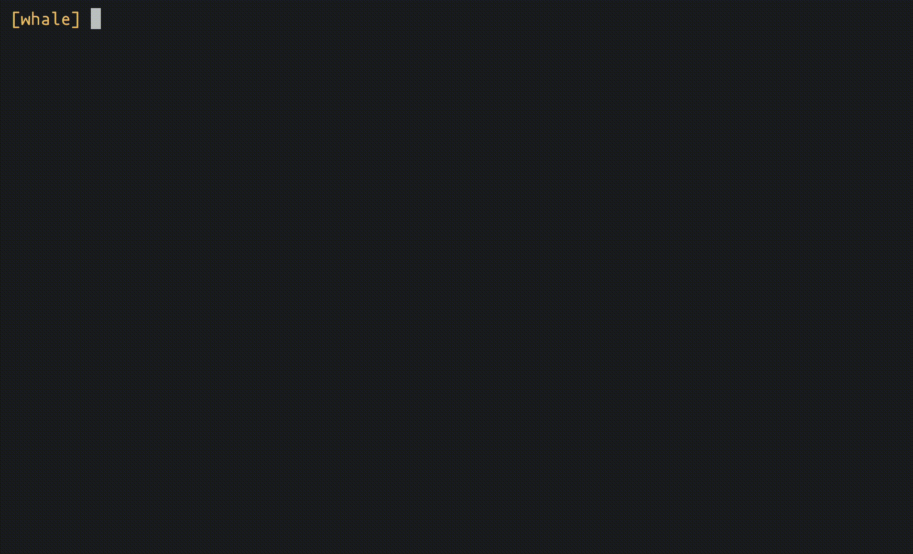

<p align="center"></p>


[](https://join.slack.com/t/talk-whale/shared_invite/zt-i2rayu1u-fljCh7reVstTBOtaH1n1xA)

`whale` is a blazingly fast markdown-based **data discovery and documentation tool**. It periodically pulls table and column info from your warehouse and makes it searchable and editable locally (with gui support handled through a remote git server, e.g. Github). [Join us on slack to discuss more!](https://join.slack.com/t/talk-whale/shared_invite/zt-i2rayu1u-fljCh7reVstTBOtaH1n1xA)

[Read the docs for a full overview of whale's capabilities!](https://docs.whale.cx)



## Installation

### Mac OS

```text
brew install dataframehq/tap/whale
```

### All others

Clone this directory and run the following in the base directory of the repo:

```text
make && make install
```
If you are running this multiple times, make sure `~/.whale/libexec` does not exist, or your virtual environment may not rebuild. We don't explicitly add an alias for the `whale` binary, so you'll want to add the following alias to your `.bash_profile` or `.zshrc` file.

```text
alias wh=~/.whale/bin/wh
```

## Getting started

### Setup

For individual use, run the following command to go through the onboarding process. It will (a) set up all necessary files in `~/.whale`, (b) walk you through cron job scheduling to periodically scrape metadata, and (c) set up a warehouse:

```text
wh init
```

The cron job will run as you schedule it (by default, every 6 hours). If you're feeling impatient, you can also manually run `wh etl` to pull down the latest data from your warehouse.

For team use, see the [docs](https://docs.whale.cx/setup/getting-started-for-teams) for instructions on how to set up and point your whale installation at a remote git server.

### Go go go!

Run:

```text
wh
```

to search over all metadata. Hitting `enter` will open the editable part of the docs in your default text editor, defined by the environmental variable `$EDITOR` (if no value is specified, whale will use the command `open`).
